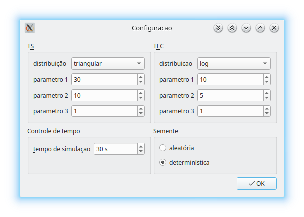

univali lavacar simulation
==========================

This is a Qt/C++ producer-consumer stochastic simulation, for a college project.

It was written in 2012, built with Qt 4 and it's not working anymore.

Maybe it can work again if compiled against Qt 4.

The source code and interface are in pt_BR.
